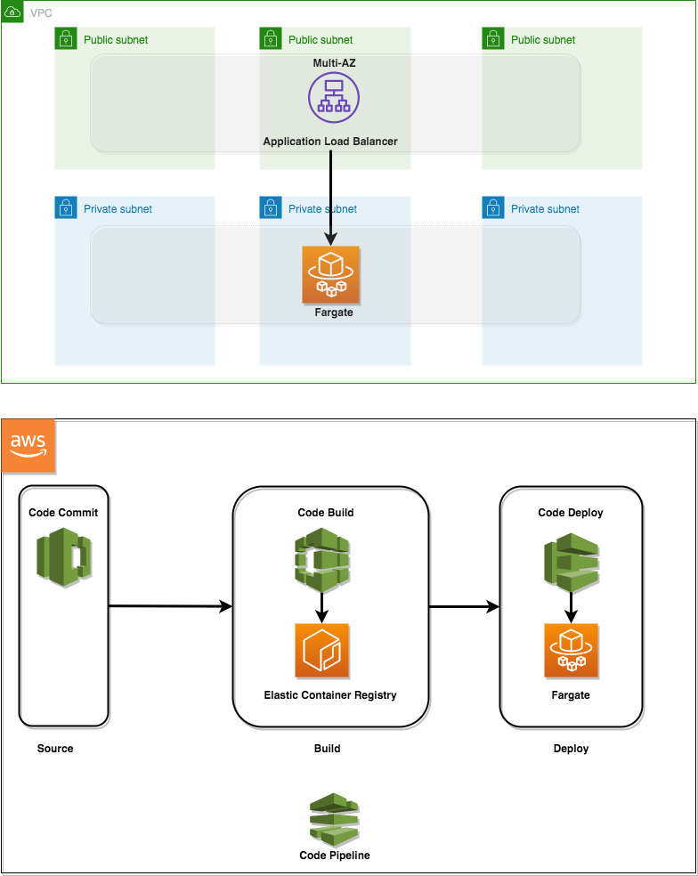

# ECS blue/ green deployment construct library

ECS blue/ green deployment construct library will enable the application teams to build and deploy code pipeline for their APIs. The construct uses a custom resource for creating the deployment configuration and builds the end-to-end infrastructure for the build and deployment.

We will be deploying a demo application to ECS Fargate.

* REST API using GoLang is deployed using Fargate compute
* CodePipeline will be used for executing Blue/Green deployment using CodeCommit, CodeBuild and CodeDeploy
* The container images will be stored in the Elastic Container Registry

Below is a diagram of the environment we will be building:




## Steps for the ECS Blue/Green Deployment

* Create the CodeCommit and CodeBuild resources
* Push the source code to CodeCommit
* Initiate the CodeBuild to create the container image in ECR
* Create the ECS cluster and service
* Create the CodePipeline with Source (using CodeCommit), Build (using CodeBuild) and Deploy (using CodeDeploy) stages

## Pre-requisites

```
brew install jq
npm i -g -f aws-cdk@1.86.0
```
* You have configured AWS CLI using `aws configure`
* You have the set the `AWS_REGION` within `aws configure`
* The role being used from CLI has the permissions required for resources being created by CDK
* Update the DockerHub login credentials - `DOCKERHUB_USERNAME` and `DOCKERHUB_PASSWORD` [here](./bin/scripts/deploy-container-image-stack.sh). This is to avoid the error `You have reached your pull rate limit`

## Build the construct

```
npm install
npm run build
npm run test
```

## Deploy the CodeCommit and CodeBuild resources

```
./bin/scripts/deploy-container-image-stack.sh
```

## Push the source code to CodeCommit
* The source code is available [here](https://github.com/smuralee/books-api)
* The [buildspec.yml](https://github.com/smuralee/books-api/buildspec.yml) has placeholders for the variables and reads the secret for DockerHub login using the SecretsManager

```
export CODE_REPO_URL=$(aws cloudformation describe-stacks --stack-name BlueGreenContainerImageStack --query 'Stacks[*].Outputs[?ExportName==`repositoryCloneUrlHttp`].OutputValue' --output text)
git clone $CODE_REPO_URL
cd books
git add .
git commit -m "First commit for the API"
git push
```

## Deploy the CodePipeline resources

```
./bin/scripts/deploy-pipeline-stack.sh
```

## Cleanup
```
./bin/scripts/destroy.sh
```
